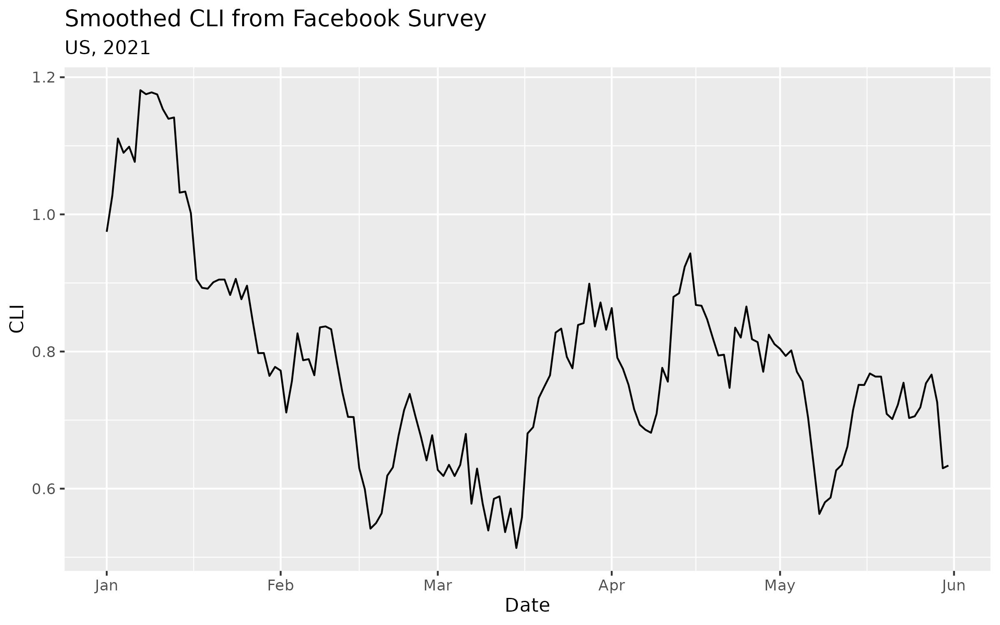

# Delphi Epidata R client

[![License: MIT][mit-image]][mit-url] [![Github Actions][github-actions-image]][github-actions-url]
[](https://app.codecov.io/gh/dsweber2/epidatr)

The [Delphi Epidata API](https://cmu-delphi.github.io/delphi-epidata/) provides real-time access to epidemiological surveillance data for influenza, COVID-19, and other diseases for the USA at various geographical resolutions, both from official government sources such as the [Center for Disease Control (CDC)](https://www.cdc.gov/datastatistics/index.html) and [Google Trends](https://cmu-delphi.github.io/delphi-epidata/api/covidcast-signals/google-symptoms.html) and private partners such as [Facebook](https://delphi.cmu.edu/blog/2020/08/26/covid-19-symptom-surveys-through-facebook/) and [Change Healthcare](https://www.changehealthcare.com/). It is built and maintained by the Carnegie Mellon University [Delphi research group](https://delphi.cmu.edu/).

This package is designed to streamline the downloading and usage of data from the [Delphi Epidata
API](https://cmu-delphi.github.io/delphi-epidata/). It provides a simple R interface to the API, including functions for downloading data, parsing the results, and converting the data into a tidy format. The API stores a historical record of all data, including corrections and updates, which is particularly useful for accurately backtesting forecasting models. We also provide packages for downstream data processing ([epiprocess](https://github.com/cmu-delphi/epiprocess)) and modeling ([epipredict](https://github.com/cmu-delphi/epipredict)).

## Usage

```R
library(epidatr)
# Obtain the smoothed covid-like illness (CLI) signal from the Facebook survey as it was on April 10, 2021 for the US
epidata <- pub_covidcast(
  source = "fb-survey",
  signals = "smoothed_cli",
  geo_type = "nation",
  time_type = "day",
  geo_values = "us",
  time_values = epirange(20210101, 20210601),
  as_of = "2021-06-01"
)
epidata
```

```
# A tibble: 6 × 15
  geo_value signal       source   geo_type time_type time_value
  <chr>     <chr>        <chr>    <fct>    <fct>     <date>
1 us        smoothed_cli fb-surv… nation   day       2021-04-05
2 us        smoothed_cli fb-surv… nation   day       2021-04-06
3 us        smoothed_cli fb-surv… nation   day       2021-04-07
4 us        smoothed_cli fb-surv… nation   day       2021-04-08
5 us        smoothed_cli fb-surv… nation   day       2021-04-09
6 us        smoothed_cli fb-surv… nation   day       2021-04-10
# ℹ 9 more variables: direction <dbl>, issue <date>,
#   lag <int>, missing_value <int>, missing_stderr <int>,
#   missing_sample_size <int>, value <dbl>, stderr <dbl>,
#   sample_size <dbl>
```

```r
# Plot this data
library(ggplot2)
ggplot(epidata, aes(x = time_value, y = value)) +
  geom_line() +
  labs(title = "Smoothed CLI from Facebook Survey",
       subtitle = "US, 2021",
       x = "Date",
       y = "CLI")
```



## Installation

Install from GitHub:

```R
# Install the dev version using `pak` or `remotes`
pak::pkg_install("cmu-delphi/epidatr")
remotes::install_github("cmu-delphi/epidatr")
```

CRAN version coming soon.

### API Keys

The Delphi API requires a (free) API key for full functionality. To generate
your key, register for a pseudo-anonymous account
[here](https://api.delphi.cmu.edu/epidata/admin/registration_form) and see more
discussion on the [general API
website](https://cmu-delphi.github.io/delphi-epidata/api/api_keys.html). The
`epidatr` client will automatically look for this key in the R option
`delphi.epidata.key` or in the environment variable
`DELPHI_EPIDATA_KEY`. We recommend storing your key in `.Renviron` file, which R
will read by default.

Note that for the time being, the private endpoints (i.e. those prefixed with
`pvt`) will require a separate key that needs to be passed as an argument.

[mit-image]: https://img.shields.io/badge/License-MIT-yellow.svg
[mit-url]: https://opensource.org/license/mit/
[github-actions-image]: https://github.com/cmu-delphi/epidatr/workflows/ci/badge.svg
[github-actions-url]: https://github.com/cmu-delphi/epidatr/actions

## Get updates

You should consider subscribing to the [API mailing list](https://lists.andrew.cmu.edu/mailman/listinfo/delphi-covidcast-api) to be notified of package updates, new data sources, corrections, and other updates.

## For users of the `covidcast` R package

The `epidatr` package is a complete rewrite of the [`covidcast` package](https://cmu-delphi.github.io/covidcast/covidcastR/), with a focus on speed, reliability, and ease of use. The `covidcast` package is deprecated and will no longer be updated.
