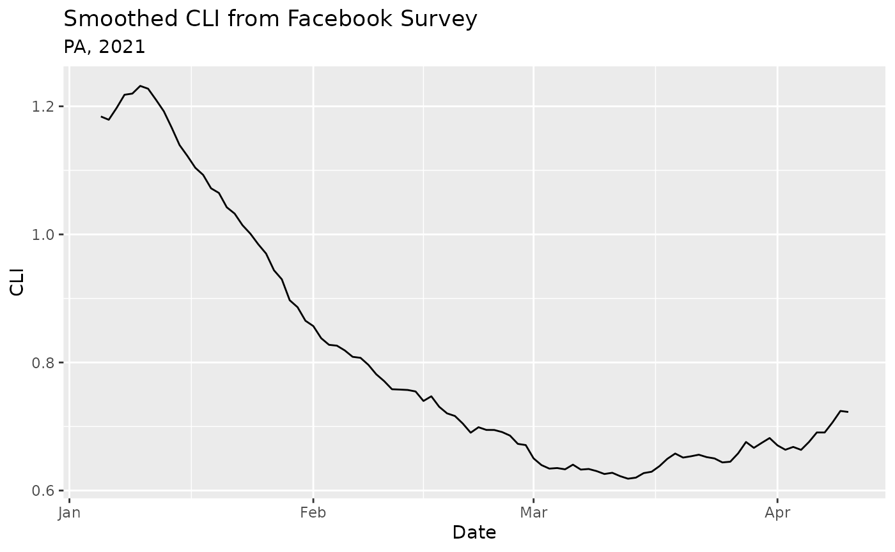
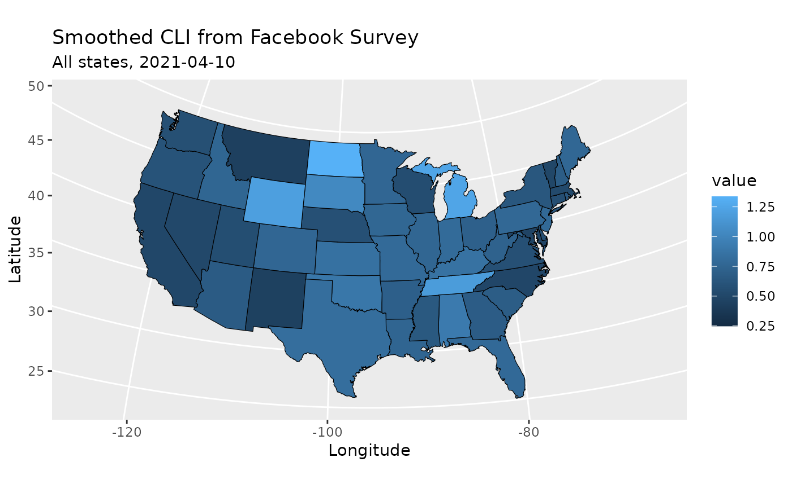

# Get started with epidatr

The epidatr package provides access to all the endpoints of the [Delphi
Epidata API](https://cmu-delphi.github.io/delphi-epidata/), and can be
used to make requests for specific signals on specific dates and in
select geographic regions.

## Setup

### Installation

You can install the stable version of this package from CRAN:

``` r

install.packages("epidatr")
pak::pkg_install("epidatr")
renv::install("epidatr")
```

Or if you want the development version, install from GitHub:

``` r

# Install the dev version using `pak` or `remotes`
pak::pkg_install("cmu-delphi/epidatr@dev")
remotes::install_github("cmu-delphi/epidatr", ref = "dev")
renv::install("cmu-delphi/epidatr@dev")
```

### API Keys

The Delphi API requires a (free) API key for full functionality. While
most endpoints are available without one, there are [limits on API usage
for anonymous
users](https://cmu-delphi.github.io/delphi-epidata/api/api_keys.html),
including a rate limit.

To generate your key, [register for a pseudo-anonymous
account](https://api.delphi.cmu.edu/epidata/admin/registration_form).
See the
[`save_api_key()`](https://cmu-delphi.github.io/epidatr/reference/get_api_key.md)
function documentation for details on how to set up `epidatr` to use
your API key.

*Note* that private endpoints (i.e. those prefixed with `pvt_`) require
a separate key that needs to be passed as an argument. These endpoints
require specific data use agreements to access.

## Basic Usage

Fetching data from the Delphi Epidata API is simple. Suppose we are
interested in the [`covidcast`
endpoint](https://cmu-delphi.github.io/delphi-epidata/api/covidcast.html),
which provides access to a [wide range of
data](https://cmu-delphi.github.io/delphi-epidata/api/covidcast_signals.html)
on COVID-19. Reviewing the endpoint documentation, we see that we [need
to
specify](https://cmu-delphi.github.io/delphi-epidata/api/covidcast.html#constructing-api-queries)
a data source name, a signal name, a geographic level, a time
resolution, and the location and times of interest.

The
[`pub_covidcast()`](https://cmu-delphi.github.io/epidatr/reference/pub_covidcast.md)
function lets us access the `covidcast` endpoint:

``` r

library(epidatr)
library(dplyr)
#> 
#> Attaching package: 'dplyr'
#> The following objects are masked from 'package:stats':
#> 
#>     filter, lag
#> The following objects are masked from 'package:base':
#> 
#>     intersect, setdiff, setequal, union

# Obtain the most up-to-date version of the smoothed covid-like illness (CLI)
# signal from the COVID-19 Trends and Impact survey for the US
epidata <- pub_covidcast(
  source = "fb-survey",
  signals = "smoothed_cli",
  geo_type = "nation",
  time_type = "day",
  geo_values = "us",
  time_values = epirange(20210105, 20210410)
)
knitr::kable(head(epidata))
```

| geo_value | signal | source | geo_type | time_type | time_value | direction | issue | lag | missing_value | missing_stderr | missing_sample_size | value | stderr | sample_size |
|:---|:---|:---|:---|:---|:---|---:|:---|---:|---:|---:|---:|---:|---:|---:|
| us | smoothed_cli | fb-survey | nation | day | 2021-01-05 | NA | 2021-01-10 | 5 | 0 | 0 | 0 | 1.184132 | 0.0162137 | 360654 |
| us | smoothed_cli | fb-survey | nation | day | 2021-01-06 | NA | 2021-01-29 | 23 | 0 | 0 | 0 | 1.179046 | 0.0162516 | 356720 |
| us | smoothed_cli | fb-survey | nation | day | 2021-01-07 | NA | 2021-01-29 | 22 | 0 | 0 | 0 | 1.197495 | 0.0165100 | 351906 |
| us | smoothed_cli | fb-survey | nation | day | 2021-01-08 | NA | 2021-01-29 | 21 | 0 | 0 | 0 | 1.218064 | 0.0167278 | 348471 |
| us | smoothed_cli | fb-survey | nation | day | 2021-01-09 | NA | 2021-01-29 | 20 | 0 | 0 | 0 | 1.219899 | 0.0168694 | 342855 |
| us | smoothed_cli | fb-survey | nation | day | 2021-01-10 | NA | 2021-01-29 | 19 | 0 | 0 | 0 | 1.231889 | 0.0171074 | 336455 |

[`pub_covidcast()`](https://cmu-delphi.github.io/epidatr/reference/pub_covidcast.md)
returns a `tibble`. (Here we’re using
[`knitr::kable()`](https://rdrr.io/pkg/knitr/man/kable.html) to make it
more readable.) Each row represents one observation in Pennsylvania on
one day. The state abbreviation is given in the `geo_value` column, the
date in the `time_value` column. Here `value` is the requested signal –
in this case, the smoothed estimate of the percentage of people with
COVID-like illness, based on the symptom surveys, and `stderr` is its
standard error.

The Epidata API makes signals available at different geographic levels,
depending on the endpoint. To request signals for all states instead of
the entire US, we use the `geo_type` argument paired with `*` for the
`geo_values` argument. (Only some endpoints allow for the use of `*` to
access data at all locations. Check the help for a given endpoint to see
if it supports `*`.)

``` r

# Obtain the most up-to-date version of the smoothed covid-like illness (CLI)
# signal from the COVID-19 Trends and Impact survey for all states
pub_covidcast(
  source = "fb-survey",
  signals = "smoothed_cli",
  geo_type = "state",
  time_type = "day",
  geo_values = "*",
  time_values = epirange(20210105, 20210410)
)
#> # A tibble: 4,896 × 15
#>   geo_value signal     source geo_type time_type time_value direction issue     
#>   <chr>     <chr>      <chr>  <fct>    <fct>     <date>         <dbl> <date>    
#> 1 ak        smoothed_… fb-su… state    day       2021-01-05        NA 2021-01-10
#> 2 al        smoothed_… fb-su… state    day       2021-01-05        NA 2021-01-10
#> 3 ar        smoothed_… fb-su… state    day       2021-01-05        NA 2021-01-10
#> 4 az        smoothed_… fb-su… state    day       2021-01-05        NA 2021-01-10
#> # ℹ 4,892 more rows
#> # ℹ 7 more variables: lag <dbl>, missing_value <dbl>, missing_stderr <dbl>,
#> #   missing_sample_size <dbl>, value <dbl>, stderr <dbl>, sample_size <dbl>
```

Alternatively, we can fetch the full time series for a subset of states
by listing out the desired locations in the `geo_value` argument and
using `*` in the `time_values` argument:

``` r

# Obtain the most up-to-date version of the smoothed covid-like illness (CLI)
# signal from the COVID-19 Trends and Impact survey for Pennsylvania
pub_covidcast(
  source = "fb-survey",
  signals = "smoothed_cli",
  geo_type = "state",
  time_type = "day",
  geo_values = c("pa", "ca", "fl"),
  time_values = "*"
)
#> # A tibble: 2,439 × 15
#>   geo_value signal     source geo_type time_type time_value direction issue     
#>   <chr>     <chr>      <chr>  <fct>    <fct>     <date>         <dbl> <date>    
#> 1 ca        smoothed_… fb-su… state    day       2020-04-06        NA 2020-09-03
#> 2 fl        smoothed_… fb-su… state    day       2020-04-06        NA 2020-09-03
#> 3 pa        smoothed_… fb-su… state    day       2020-04-06        NA 2020-09-03
#> 4 ca        smoothed_… fb-su… state    day       2020-04-07        NA 2020-09-03
#> # ℹ 2,435 more rows
#> # ℹ 7 more variables: lag <dbl>, missing_value <dbl>, missing_stderr <dbl>,
#> #   missing_sample_size <dbl>, value <dbl>, stderr <dbl>, sample_size <dbl>
```

## Getting versioned data

The Epidata API stores a historical record of all data, including
corrections and updates, which is particularly useful for accurately
backtesting forecasting models. To retrieve versioned data, we can use
the `as_of` argument, which fetches the data as it was known on a
specific date.

``` r

# Obtain the smoothed covid-like illness (CLI) signal from the COVID-19
# Trends and Impact survey for Pennsylvania as it was on 2021-06-01
pub_covidcast(
  source = "fb-survey",
  signals = "smoothed_cli",
  geo_type = "state",
  time_type = "day",
  geo_values = "pa",
  time_values = epirange(20210105, 20210410),
  as_of = "2021-06-01"
)
#> # A tibble: 96 × 15
#>   geo_value signal     source geo_type time_type time_value direction issue     
#>   <chr>     <chr>      <chr>  <fct>    <fct>     <date>         <dbl> <date>    
#> 1 pa        smoothed_… fb-su… state    day       2021-01-05        NA 2021-01-10
#> 2 pa        smoothed_… fb-su… state    day       2021-01-06        NA 2021-01-29
#> 3 pa        smoothed_… fb-su… state    day       2021-01-07        NA 2021-01-29
#> 4 pa        smoothed_… fb-su… state    day       2021-01-08        NA 2021-01-29
#> # ℹ 92 more rows
#> # ℹ 7 more variables: lag <dbl>, missing_value <dbl>, missing_stderr <dbl>,
#> #   missing_sample_size <dbl>, value <dbl>, stderr <dbl>, sample_size <dbl>
```

We can also request all versions of the data issued within a specific
time range using the `issues` argument. `issues` can also take a single
date.

``` r

# See how the estimate for a SINGLE day (March 1, 2021) evolved
# by fetching all issues reported between March and April 2021.
pub_covidcast(
  source = "fb-survey",
  signals = "smoothed_cli",
  geo_type = "state",
  time_type = "day",
  geo_values = "pa",
  time_values = "2021-03-01",
  issues = epirange("2021-03-01", "2021-04-30")
)
#> # A tibble: 6 × 15
#>   geo_value signal     source geo_type time_type time_value direction issue     
#>   <chr>     <chr>      <chr>  <fct>    <fct>     <date>         <dbl> <date>    
#> 1 pa        smoothed_… fb-su… state    day       2021-03-01        NA 2021-03-02
#> 2 pa        smoothed_… fb-su… state    day       2021-03-01        NA 2021-03-03
#> 3 pa        smoothed_… fb-su… state    day       2021-03-01        NA 2021-03-04
#> 4 pa        smoothed_… fb-su… state    day       2021-03-01        NA 2021-03-05
#> # ℹ 2 more rows
#> # ℹ 7 more variables: lag <dbl>, missing_value <dbl>, missing_stderr <dbl>,
#> #   missing_sample_size <dbl>, value <dbl>, stderr <dbl>, sample_size <dbl>
```

Finally, we can use the `lag` argument to request only data that was
reported a certain number of days after the event.

``` r

# Fetch survey data for January 2021, but ONLY include data
# that was issued exactly 2 days after it was collected.
pub_covidcast(
  source = "fb-survey",
  signals = "smoothed_cli",
  geo_type = "state",
  time_type = "day",
  geo_values = "pa",
  time_values = epirange(20210101, 20210131),
  lag = 2
)
#> # A tibble: 31 × 15
#>   geo_value signal     source geo_type time_type time_value direction issue     
#>   <chr>     <chr>      <chr>  <fct>    <fct>     <date>         <dbl> <date>    
#> 1 pa        smoothed_… fb-su… state    day       2021-01-01        NA 2021-01-03
#> 2 pa        smoothed_… fb-su… state    day       2021-01-02        NA 2021-01-04
#> 3 pa        smoothed_… fb-su… state    day       2021-01-03        NA 2021-01-05
#> 4 pa        smoothed_… fb-su… state    day       2021-01-04        NA 2021-01-06
#> # ℹ 27 more rows
#> # ℹ 7 more variables: lag <dbl>, missing_value <dbl>, missing_stderr <dbl>,
#> #   missing_sample_size <dbl>, value <dbl>, stderr <dbl>, sample_size <dbl>
```

See
[`vignette("versioned-data")`](https://cmu-delphi.github.io/epidatr/articles/versioned-data.md)
for details and more ways to specify versioned data.

## Plotting

Because the output data is in a standard `tibble` format, we can easily
plot it using `ggplot2`:

``` r

library(ggplot2)
ggplot(epidata, aes(x = time_value, y = value)) +
  geom_line() +
  labs(
    title = "Smoothed CLI from Facebook Survey",
    subtitle = "PA, 2021",
    x = "Date",
    y = "CLI"
  )
```



`ggplot2` can also be used to [create
choropleths](https://r-graphics.org/RECIPE-MISCGRAPH-CHOROPLETH.html).

``` r

library(maps)

# Obtain the most up-to-date version of the smoothed covid-like illness (CLI)
# signal from the COVID-19 Trends and Impact survey for all states on a single day
cli_states <- pub_covidcast(
  source = "fb-survey",
  signals = "smoothed_cli",
  geo_type = "state",
  time_type = "day",
  geo_values = "*",
  time_values = 20210410
)

# Get a mapping of states to longitude/latitude coordinates
states_map <- map_data("state")

# Convert state abbreviations into state names
cli_states <- mutate(
  cli_states,
  state = ifelse(
    geo_value == "dc",
    "district of columbia",
    state.name[match(geo_value, tolower(state.abb))] %>% tolower()
  )
)

# Add coordinates for each state
cli_states <- left_join(states_map, cli_states, by = c("region" = "state"))

# Plot
ggplot(cli_states, aes(x = long, y = lat, group = group, fill = value)) +
  geom_polygon(colour = "black", linewidth = 0.2) +
  coord_map("polyconic") +
  labs(
    title = "Smoothed CLI from Facebook Survey",
    subtitle = "All states, 2021-04-10",
    x = "Longitude",
    y = "Latitude"
  )
```



## Finding locations of interest

Most data is only available for the US. Select endpoints report other
countries at the national and/or regional levels. Endpoint descriptions
explicitly state when they cover non-US locations.

For endpoints that report US data, see the [geographic coding
documentation](https://cmu-delphi.github.io/delphi-epidata/api/covidcast_geography.html)
for available geographic levels.

### International data

International data is available via

- `pub_dengue_nowcast` (North and South America)
- `pub_ecdc_ili` (Europe)
- `pub_kcdc_ili` (Korea)
- `pub_nidss_dengue` (Taiwan)
- `pub_nidss_flu` (Taiwan)
- `pub_paho_dengue` (North and South America)
- `pvt_dengue_sensors` (North and South America)

## Finding data sources and signals of interest

Above we used data from [Delphi’s symptom
surveys](https://delphi.cmu.edu/covid19/ctis/), but the Epidata API
includes numerous data streams: medical claims data, cases and deaths,
mobility, and many others. This can make it a challenge to find the data
stream that you are most interested in.

The Epidata documentation lists all the data sources and signals
available through the API for
[COVID-19](https://cmu-delphi.github.io/delphi-epidata/api/covidcast_signals.html)
and for [other
diseases](https://cmu-delphi.github.io/delphi-epidata/api/README.html#source-specific-parameters).

You can also use the
[`avail_endpoints()`](https://cmu-delphi.github.io/epidatr/reference/avail_endpoints.md)
function to get a table of endpoint functions:

``` r

avail_endpoints()
```

    #> ℹ Data is available for the US only, unless otherwise specified

| Endpoint | Description |
|:---|:---|
| cast_api_queries() | cast-API snapshot and archive queries |
| epidata_meta() | Get cast-API source metadata |
| pub_covid_hosp_facility() | COVID hospitalizations by facility |
| pub_covid_hosp_facility_lookup() | Helper for finding COVID hospitalization facilities |
| pub_covid_hosp_state_timeseries() | COVID hospitalizations by state |
| pub_covidcast() | Various COVID and flu signals via the COVIDcast endpoint |
| pub_covidcast_meta() | Metadata for the COVIDcast endpoint |
| pub_delphi() | Delphi’s ILINet outpatient doctor visits forecasts |
| pub_dengue_nowcast() | Delphi’s PAHO dengue nowcasts (North and South America) |
| pub_ecdc_ili() | ECDC ILI incidence (Europe) |
| pub_flusurv() | CDC FluSurv flu hospitalizations |
| pub_fluview() | CDC FluView ILINet outpatient doctor visits |
| pub_fluview_clinical() | CDC FluView flu tests from clinical labs |
| pub_fluview_meta() | Metadata for the FluView endpoint |
| pub_gft() | Google Flu Trends flu search volume |
| pub_kcdc_ili() | KCDC ILI incidence (Korea) |
| pub_meta() | Metadata for the Delphi Epidata API |
| pub_nidss_dengue() | NIDSS dengue cases (Taiwan) |
| pub_nidss_flu() | NIDSS flu doctor visits (Taiwan) |
| pub_nowcast() | Delphi’s ILI Nearby nowcasts |
| pub_paho_dengue() | PAHO dengue data (North and South America) |
| pub_wiki() | Wikipedia webpage counts by article |
| pvt_cdc() | CDC total and by topic webpage visits |
| pvt_dengue_sensors() | PAHO dengue digital surveillance sensors (North and South America) |
| pvt_ght() | Google Health Trends health topics search volume |
| pvt_meta_norostat() | Metadata for the NoroSTAT endpoint |
| pvt_norostat() | CDC NoroSTAT norovirus outbreaks |
| pvt_quidel() | Quidel COVID-19 and influenza testing data |
| pvt_sensors() | Influenza and dengue digital surveillance sensors |
| pvt_twitter() | HealthTweets total and influenza-related tweets |

See
[`vignette("signal-discovery")`](https://cmu-delphi.github.io/epidatr/articles/signal-discovery.md)
for more information.
