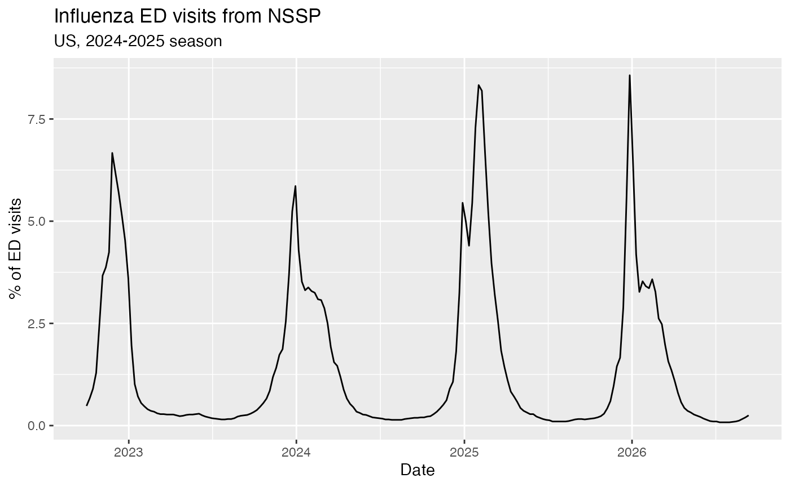
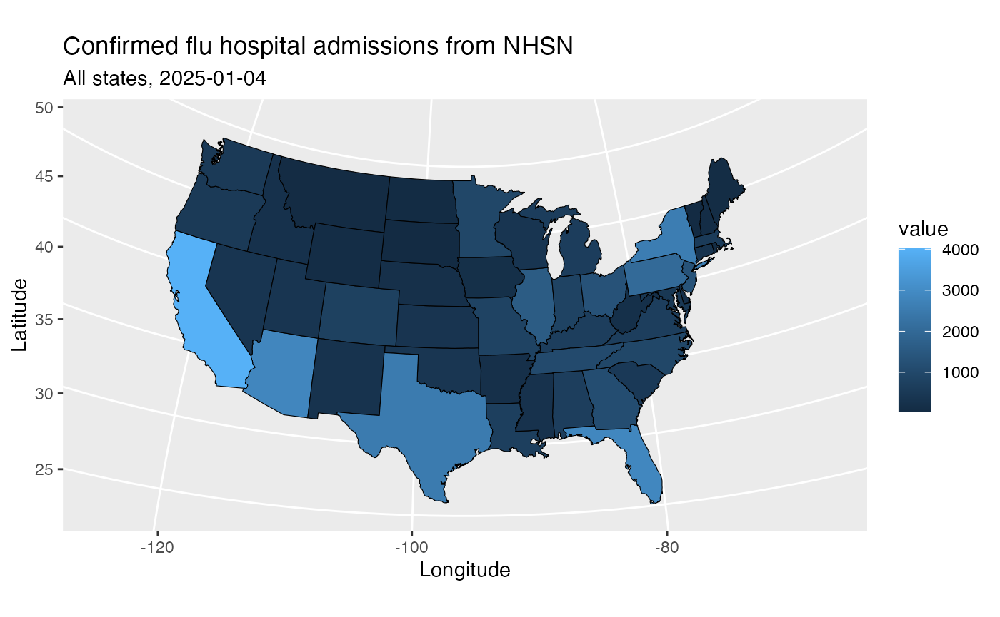
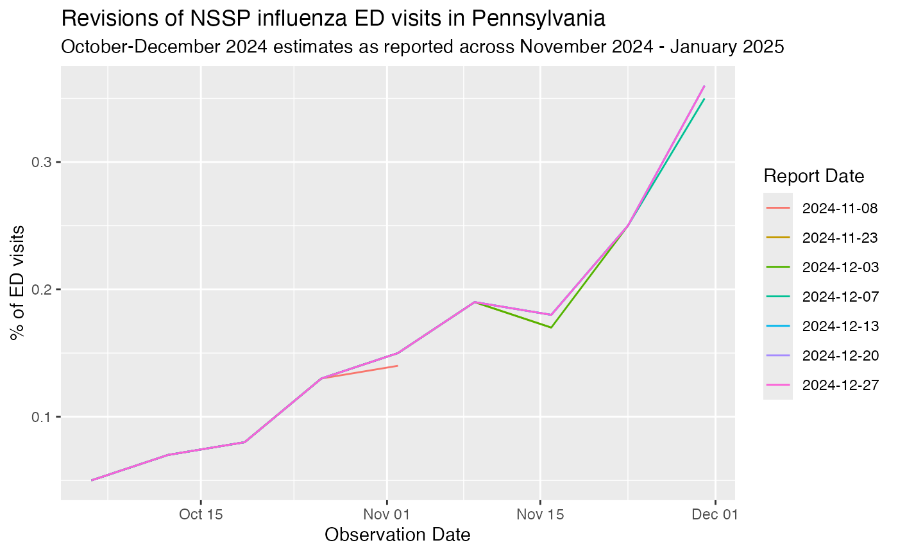

The epidatr package provides access to all the endpoints of the [Delphi Epidata
API](https://cmu-delphi.github.io/delphi-epidata/), and can be used to make
requests for specific signals on specific dates and in select geographic
regions. It is widely used in epidemiological research, real-time forecasting
models, and public health dashboards.


## Setup

### Installation

You can install the stable version of this package from CRAN:

```R
# Install from CRAN
install.packages("epidatr")
# or using pak
pak::pkg_install("epidatr")
# or using renv
renv::install("epidatr")
```

Or if you want the development version, install from GitHub:

```R
# Install the dev version using pak
pak::pkg_install("cmu-delphi/epidatr@dev")
# or using remotes
remotes::install_github("cmu-delphi/epidatr", ref = "dev")
# or using renv
renv::install("cmu-delphi/epidatr@dev")
```

### API Keys

The Delphi API requires a (free) API key for full functionality. While most
endpoints are available without one, there are
[limits on API usage for anonymous users](https://cmu-delphi.github.io/delphi-epidata/api/api_keys.html),
including a rate limit.

To generate your key,
[register for a pseudo-anonymous account](https://api.delphi.cmu.edu/epidata/admin/registration_form).
See the `save_api_key()` function documentation for details on how to set up
`epidatr` to use your API key.

## The Delphi V5 API

Epidatr allows three categories of data access to the Delphi V5 API:

- `epidata_snapshot()` provides a specific view of how a dataset looked at a point in time.
- `epidata_archive()` fetches all versions of a dataset across time, representing the full revision history.
- `epidata_aux()` accesses source-specific auxiliary tables containing metadata, laboratory protocols, or additional static keys (such as NWSS wastewater facility descriptions).

Additionally, `epidata_meta()` provides access to system metadata to list available sources, signals, geographic granularities, and date ranges.


## Basic Usage

To make a request of a particular data source at a specific point in time,
we'll use `epidata_snapshot()`. This function needs the source name, signal
name, and a geographic level in order to complete a query.

Suppose we are interested in the `nssp` source, which provides access to a
[wide range of](https://cmu-delphi.github.io/delphi-epidata/api/v5-signals/nssp.html)
emergency department visits data:


``` r
library(epidatr)
library(dplyr)
#> Warning: package 'dplyr' was built under R version 4.5.2
#> 
#> Attaching package: 'dplyr'
#> The following objects are masked from 'package:stats':
#> 
#>     filter, lag
#> The following objects are masked from 'package:base':
#> 
#>     intersect, setdiff, setequal, union

# Obtain the latest snapshot of the influenza ED-visit percentage
# from the NSSP source for the US
epidata <- epidata_snapshot(
  source = "nssp",
  signals = "pct_ed_visits_influenza",
  geo_type = "nation"
)
knitr::kable(head(epidata))
```


|signal                  |report_time |geo_type |geo_value |fill_method |reference_time | value|
|:-----------------------|:-----------|:--------|:---------|:-----------|:--------------|-----:|
|pct_ed_visits_influenza |2026-06-26  |nation   |us        |source      |2022-10-01     |  0.48|
|pct_ed_visits_influenza |2026-06-26  |nation   |us        |source      |2022-10-08     |  0.67|
|pct_ed_visits_influenza |2026-06-26  |nation   |us        |source      |2022-10-15     |  0.90|
|pct_ed_visits_influenza |2026-06-26  |nation   |us        |source      |2022-10-22     |  1.29|
|pct_ed_visits_influenza |2026-06-26  |nation   |us        |source      |2022-10-29     |  2.47|
|pct_ed_visits_influenza |2026-06-26  |nation   |us        |source      |2022-11-05     |  3.67|


`epidata_snapshot()` returns a [`tibble`](https://tibble.tidyverse.org/) (a
modern reimagining of R's standard data frame that prints cleanly and preserves
typed columns). (Here we're using `knitr::kable()` to make it more readable.)
Each row represents one observation for the US on one date. The location is
given in the `geo_value` column, the date it describes in the `reference_time`
column, the value of the requested signal in `value`, and the publication date in
`report_time`.

The Delphi V5 API makes signals available at different geographic levels,
depending on the source. Use `epidata_meta("nssp")` for a given source to see
which geo types it supports.

To request signals for all states instead of the entire US, we use the
`geo_type` argument. This automatically returns all available data for that geo
type:


``` r
# Obtain the latest snapshot of the influenza ED-visit percentage
# from the NSSP source across all available dates and states
epidata_snapshot(
  source = "nssp",
  signals = "pct_ed_visits_influenza",
  geo_type = "state"
)
#> # A tibble: 10,557 × 7
#>   signal         report_time geo_type geo_value fill_method reference_time value
#>   <chr>          <date>      <chr>    <chr>     <chr>       <date>         <dbl>
#> 1 pct_ed_visits… 2026-06-26  state    ak        source      2022-10-01     0.140
#> 2 pct_ed_visits… 2026-06-26  state    ak        source      2022-10-08     0.240
#> 3 pct_ed_visits… 2026-06-26  state    ak        source      2022-10-15     0.320
#> 4 pct_ed_visits… 2026-06-26  state    ak        source      2022-10-22     0.760
#> # ℹ 10,553 more rows
```

You can also query multiple signals in a single request by passing a vector to
`signals`:


``` r
# Obtain both influenza and COVID-19 ED-visit percentages in a single query
epidata_snapshot(
  source = "nssp",
  signals = c("pct_ed_visits_influenza", "pct_ed_visits_covid"),
  geo_type = "state",
  geo_values = "pa",
  reference_time = epirange("2024-12-01", "2024-12-15")
)
#> # A tibble: 4 × 7
#>   signal         report_time geo_type geo_value fill_method reference_time value
#>   <chr>          <date>      <chr>    <chr>     <chr>       <date>         <dbl>
#> 1 pct_ed_visits… 2026-06-26  state    pa        source      2024-12-07     0.75 
#> 2 pct_ed_visits… 2026-06-26  state    pa        source      2024-12-07     0.570
#> 3 pct_ed_visits… 2026-06-26  state    pa        source      2024-12-14     0.820
#> 4 pct_ed_visits… 2026-06-26  state    pa        source      2024-12-14     0.870
```

Alternatively, we can fetch the time series for a subset of states and
reference dates by listing out the desired locations in the `geo_values`
argument and using a range in the `reference_time` argument:


``` r
# Obtain the data from January 1st, 2024 to January 1st, 2025
# of the influenza ED-visit percentage from the NSSP source for 
# Pennsylvania, California, and Florida
epidata_snapshot(
  source = "nssp",
  signals = "pct_ed_visits_influenza",
  geo_type = "state",
  geo_values = c("pa", "ca", "fl"),
  reference_time = epirange("2024-01-01", "2025-01-01")
)
#> # A tibble: 156 × 7
#>   signal         report_time geo_type geo_value fill_method reference_time value
#>   <chr>          <date>      <chr>    <chr>     <chr>       <date>         <dbl>
#> 1 pct_ed_visits… 2026-06-26  state    ca        source      2024-02-03     1.31 
#> 2 pct_ed_visits… 2026-06-26  state    ca        source      2024-02-17     0.990
#> 3 pct_ed_visits… 2026-06-26  state    ca        source      2024-03-02     0.760
#> 4 pct_ed_visits… 2026-06-26  state    ca        source      2024-03-09     0.650
#> # ℹ 152 more rows
```

## Getting versioned data

The Delphi V5 API stores a historical record of all data, including corrections
and updates, which is particularly useful for accurately backtesting
forecasting models. To retrieve versioned data in `epidata_snapshot()`, we can
use the `snapshot_date` argument, which fetches the data as it was known on a
specific date.


``` r
# Obtain the influenza ED-visit percentage from NSSP for Pennsylvania
# as it was known on 2025-01-01
epidata_snapshot(
  source = "nssp",
  signals = "pct_ed_visits_influenza",
  geo_type = "state",
  geo_values = "pa",
  snapshot_date = "2025-01-01"
)
#> # A tibble: 117 × 7
#>   signal         report_time geo_type geo_value fill_method reference_time value
#>   <chr>          <date>      <chr>    <chr>     <chr>       <date>         <dbl>
#> 1 pct_ed_visits… 2024-12-27  state    pa        source      2022-10-01     0.120
#> 2 pct_ed_visits… 2024-12-27  state    pa        source      2022-10-08     0.100
#> 3 pct_ed_visits… 2024-12-27  state    pa        source      2022-10-15     0.210
#> 4 pct_ed_visits… 2024-12-27  state    pa        source      2022-10-22     0.330
#> # ℹ 113 more rows
```

To request all versions of the data issued within a specific time range, we
use `epidata_archive()` with the `report_time` argument. This parameter allows
us to fetch versions using comparison operators (e.g., `"<2025-01-15>"`) or an
`epirange()`.


``` r
# See how the estimate for a SINGLE reference date (2024-12-07) evolved
# by fetching all reports issued in December 2024 and early January 2025
epidata_archive(
  source = "nssp",
  signals = "pct_ed_visits_influenza",
  geo_type = "state",
  geo_values = "pa",
  reference_time = "2024-12-07",
  report_time = epirange("2024-12-01", "2025-01-15")
)
#> # A tibble: 5 × 7
#>   signal         report_time geo_type geo_value fill_method reference_time value
#>   <chr>          <date>      <chr>    <chr>     <chr>       <date>         <dbl>
#> 1 pct_ed_visits… 2024-12-13  state    pa        source      2024-12-07     0.550
#> 2 pct_ed_visits… 2024-12-20  state    pa        source      2024-12-07     0.560
#> 3 pct_ed_visits… 2024-12-27  state    pa        source      2024-12-07     0.560
#> 4 pct_ed_visits… 2025-01-03  state    pa        source      2024-12-07     0.560
#> # ℹ 1 more row
```

See `vignette("versioned-data")` for details and more ways to specify
versioned data.


## Auxiliary data

Some sources include extra columns connected to the signal data, such as the
population served by each NWSS sewershed or site metadata. `epidata_aux()`
retrieves this auxiliary data, either on its own or merged onto a signal pull.

You can pull auxiliary data directly by source. To see what key columns you can
filter on for a given source, consult that source's page in the
[V5 signals documentation](https://cmu-delphi.github.io/delphi-epidata/api/v5_signals.html).
Named filters on these key columns can be passed through `...` to limit the
returned rows, and `columns` can be used to select specific fields:


``` r
aux_data <- epidata_aux(
  source = "nwss",
  pcr_target = "sars-cov-2",
  sample_index = c("92012", "92013")
)
knitr::kable(head(aux_data))
```


|report_time |geo_value |reference_time |nwss_source |sample_index |pcr_target |report_ts_nominal_end |state_territory |county_fips |counties_served |population_served |sample_type                   |sample_matrix     |sample_location |flow_rate |concentration_method |pasteurized |pcr_type |extraction_method                                       |major_lab_method |inhibition_detect |inhibition_adjust |ntc_amplify |pcr_gene_target_agg |pcr_target_units    |lod_sewage |hum_frac_target_mic      |hum_frac_mic_conc |hum_frac_mic_unit   |rec_eff_percent |rec_eff_target_name |rec_eff_spike_matrix |rec_eff_spike_conc |pipeline_run_id |report_ts_actual    |comments |
|:-----------|:---------|:--------------|:-----------|:------------|:----------|:---------------------|:---------------|:-----------|:---------------|:-----------------|:-----------------------------|:-----------------|:---------------|:---------|:--------------------|:-----------|:--------|:-------------------------------------------------------|:----------------|:-----------------|:-----------------|:-----------|:-------------------|:-------------------|:----------|:------------------------|:-----------------|:-------------------|:---------------|:-------------------|:--------------------|:------------------|:---------------|:-------------------|:--------|
|2026-06-26  |162       |2026-01-27     |CDC_Verily  |92012        |sars-cov-2 |NA                    |ca              |06079       |San Luis Obispo |14465             |24-hr time-weighted composite |post grit removal |wwtp            |0.45      |ceres nanotrap       |f           |ddpcr    |thermo magmax viral/pathogen nucleic acid isolation kit |2                |f                 |f                 |f           |n                   |copies/l wastewater |1500       |pepper mild mottle virus |153424325.78462   |copies/l wastewater |40.7            |bcov vaccine        |clarified sample     |5                  |7914            |2026-06-26 21:04:11 |NA       |
|2026-06-19  |162       |2026-01-27     |CDC_Verily  |92012        |sars-cov-2 |2026-06-26 00:00:00   |ca              |06079       |San Luis Obispo |14465             |24-hr time-weighted composite |post grit removal |wwtp            |0.45      |ceres nanotrap       |f           |ddpcr    |thermo magmax viral/pathogen nucleic acid isolation kit |2                |f                 |f                 |f           |n                   |copies/l wastewater |1500       |pepper mild mottle virus |153424325.78462   |copies/l wastewater |40.7            |bcov vaccine        |clarified sample     |5                  |7895            |2026-06-26 21:02:14 |NA       |
|2026-06-12  |162       |2026-01-27     |CDC_Verily  |92012        |sars-cov-2 |2026-06-19 00:00:00   |ca              |06079       |San Luis Obispo |14465             |24-hr time-weighted composite |post grit removal |wwtp            |0.45      |ceres nanotrap       |f           |ddpcr    |thermo magmax viral/pathogen nucleic acid isolation kit |2                |f                 |f                 |f           |n                   |copies/l wastewater |1500       |pepper mild mottle virus |153424325.78462   |copies/l wastewater |40.7            |bcov vaccine        |clarified sample     |5                  |7879            |2026-06-26 21:00:39 |NA       |
|2026-06-05  |162       |2026-01-27     |CDC_Verily  |92012        |sars-cov-2 |2026-06-12 00:00:00   |ca              |06079       |San Luis Obispo |14465             |24-hr time-weighted composite |post grit removal |wwtp            |0.45      |ceres nanotrap       |f           |ddpcr    |thermo magmax viral/pathogen nucleic acid isolation kit |2                |f                 |f                 |f           |n                   |copies/l wastewater |1500       |pepper mild mottle virus |153424325.78462   |copies/l wastewater |40.7            |bcov vaccine        |clarified sample     |5                  |7868            |2026-06-26 20:59:33 |NA       |
|2026-05-30  |162       |2026-01-27     |CDC_Verily  |92012        |sars-cov-2 |2026-06-05 00:00:00   |ca              |06079       |San Luis Obispo |14465             |24-hr time-weighted composite |post grit removal |wwtp            |0.45      |ceres nanotrap       |f           |ddpcr    |thermo magmax viral/pathogen nucleic acid isolation kit |2                |f                 |f                 |f           |n                   |copies/l wastewater |1500       |pepper mild mottle virus |153424325.78462   |copies/l wastewater |40.7            |bcov vaccine        |clarified sample     |5                  |7858            |2026-06-26 20:58:46 |NA       |
|2026-05-29  |162       |2026-01-27     |CDC_Verily  |92012        |sars-cov-2 |2026-05-30 00:00:00   |ca              |06079       |San Luis Obispo |14465             |24-hr time-weighted composite |post grit removal |wwtp            |0.45      |ceres nanotrap       |f           |ddpcr    |thermo magmax viral/pathogen nucleic acid isolation kit |2                |f                 |f                 |f           |n                   |copies/l wastewater |1500       |pepper mild mottle virus |153424325.78462   |copies/l wastewater |40.7            |bcov vaccine        |clarified sample     |5                  |7847            |2026-06-26 20:57:31 |NA       |


You can also attach auxiliary columns directly to a signal pull by passing the
output of `epidata_snapshot()` or `epidata_archive()` directly to `epidata_aux()`.
In this workflow, `epidata_aux()` fetches the matching auxiliary data and
left-joins it onto the shared key columns:


``` r
# Fetch signal data for a specific sewershed
nwss_data <- epidata_snapshot(
  source = "nwss",
  signals = "covid_avg_conc",
  geo_type = "sewershed",
  geo_values = "128",
  reference_time = epirange("2024-12-01", "2025-01-01")
)
head(nwss_data)
#> # A tibble: 6 × 10
#>   signal   report_time geo_type geo_value fill_method reference_time nwss_source
#>   <chr>    <date>      <chr>    <chr>     <chr>       <date>         <chr>      
#> 1 covid_a… 2026-06-26  sewersh… 128       source      2024-12-19     CDC_Verily 
#> 2 covid_a… 2026-06-26  sewersh… 128       source      2024-12-03     CDC_Verily 
#> 3 covid_a… 2026-06-26  sewersh… 128       source      2024-12-17     CDC_Verily 
#> 4 covid_a… 2026-06-26  sewersh… 128       source      2024-12-12     CDC_Verily 
#> # ℹ 2 more rows
#> # ℹ 3 more variables: sample_index <chr>, pcr_target <chr>, value <dbl>

# Attach auxiliary metadata
nwss_merged <- nwss_data %>%
  epidata_aux()
head(nwss_merged)
#> # A tibble: 6 × 40
#>   signal   report_time geo_type geo_value fill_method reference_time nwss_source
#>   <chr>    <date>      <chr>    <chr>     <chr>       <date>         <chr>      
#> 1 covid_a… 2026-06-26  sewersh… 128       source      2024-12-19     CDC_Verily 
#> 2 covid_a… 2026-06-26  sewersh… 128       source      2024-12-03     CDC_Verily 
#> 3 covid_a… 2026-06-26  sewersh… 128       source      2024-12-17     CDC_Verily 
#> 4 covid_a… 2026-06-26  sewersh… 128       source      2024-12-12     CDC_Verily 
#> # ℹ 2 more rows
#> # ℹ 33 more variables: sample_index <chr>, pcr_target <chr>, value <dbl>,
#> #   report_ts_nominal_end <chr>, state_territory <chr>, county_fips <chr>,
#> #   counties_served <chr>, population_served <chr>, sample_type <chr>,
#> #   sample_matrix <chr>, sample_location <chr>, flow_rate <chr>,
#> #   concentration_method <chr>, pasteurized <chr>, pcr_type <chr>,
#> #   extraction_method <chr>, major_lab_method <chr>, inhibition_detect <chr>, …
```

If you don't pass explicit key filters, `epidata_aux()` automatically infers them
from the base dataset.


## Advanced queries

### Server-side key filtering

Beyond standard arguments (`source`, `signals`, `geo_type`), some sources include
extra key dimensions that categorize the data (for example, `nwss` categorizes by
`pcr_target`, and `pophive` categorizes by `age_group`). To see what key columns
are available per source, consult that source's page in the
[V5 signals documentation](https://cmu-delphi.github.io/delphi-epidata/api/v5_signals.html).
You can pass these extra dimensions directly as named parameters to filter the query
server-side:


``` r
epidata_snapshot(
  source = "nwss",
  signals = "pcr_conc_smoothed",
  geo_type = "county",
  pcr_target = c("sars-cov-2", "influenza")
)
```

### Dry runs

If you want to inspect the generated API request URL underlying each function
query without actually fetching data, you can pass `dry_run = TRUE` via
`fetch_args_list()`. This works with `epidata_snapshot()`, `epidata_archive()`,
and `epidata_aux()`:


``` r
dry_run_call <- epidata_snapshot(
  source = "nssp",
  signals = "pct_ed_visits_influenza",
  geo_type = "state",
  fetch_args = fetch_args_list(dry_run = TRUE)
)
dry_run_call
#> 
#> ── <epidata_call> object: ──────────────────────────────────────────────────────
#> • Pipe this object into `fetch()` to actually fetch the data
#> • Request URL:
#>   https://delphi.cmu.edu/epidata/v5/snapshot/?source=nssp&signal=pct_ed_visits_influenza&geo_type=state
```


## Plotting

Because the output data is in a standard `tibble` format, we can easily plot
it using `ggplot2`:


``` r
library(ggplot2)
#> Warning: package 'ggplot2' was built under R version 4.5.2

# Plot the influenza ED-visit time series fetched earlier with epidata_snapshot()
ggplot(epidata, aes(x = reference_time, y = value)) +
  geom_line() +
  labs(
    title = "Influenza ED visits from NSSP",
    subtitle = "US, 2024-2025 season",
    x = "Date",
    y = "% of ED visits"
  )
```

<div class="figure">

<p class="caption">plot of chunk unnamed-chunk-12</p>
</div>

`ggplot2` can also be used with `epidatr` and `maps` to [create choropleths](https://r-graphics.org/RECIPE-MISCGRAPH-CHOROPLETH.html):


```{.r .fold-hide}
library(epidatr)
library(dplyr)
library(ggplot2)
library(maps)

# Obtain the latest snapshot of confirmed flu hospital admissions
# from NHSN for all states on a single reference date
nhsn_states <- epidata_snapshot(
  source = "nhsn",
  signals = "confirmed_admissions_flu_ew",
  geo_type = "state",
  geo_values = "*",
  reference_time = "2025-01-04"
)

# Get a mapping of states to longitude/latitude coordinates
states_map <- map_data("state")

# Convert state abbreviations into state names
nhsn_states <- mutate(
  nhsn_states,
  state = ifelse(
    geo_value == "dc",
    "district of columbia",
    state.name[match(geo_value, tolower(state.abb))] %>% tolower()
  )
)

# Add coordinates for each state
nhsn_states <- left_join(states_map, nhsn_states, by = c("region" = "state"))

# Plot
ggplot(nhsn_states, aes(x = long, y = lat, group = group, fill = value)) +
  geom_polygon(colour = "black", linewidth = 0.2) +
  coord_map("polyconic") +
  labs(
    title = "Confirmed flu hospital admissions from NHSN",
    subtitle = "All states, 2025-01-04",
    x = "Longitude",
    y = "Latitude"
  )
```

<div class="figure">

<p class="caption">plot of chunk unnamed-chunk-13</p>
</div>

### Plotting revision histories

We can also visualize revision histories from `epidata_archive()`. Each line
shows what the time series looked like as of a different publication date:


``` r
# Fetch revision history for Pennsylvania influenza ED visits
pa_revisions <- epidata_archive(
  source = "nssp",
  signals = "pct_ed_visits_influenza",
  geo_type = "state",
  geo_values = "pa",
  reference_time = epirange("2024-10-01", "2024-12-01"),
  report_time = epirange("2024-11-01", "2025-01-01")
)

ggplot(pa_revisions, aes(x = reference_time, y = value, group = report_time, color = as.factor(report_time))) +
  geom_line() +
  labs(
    title = "Revisions of NSSP influenza ED visits in Pennsylvania",
    subtitle = "October-December 2024 estimates as reported across November 2024 - January 2025",
    x = "Observation Date",
    y = "% of ED visits",
    color = "Report Date"
  )
```

<div class="figure">

<p class="caption">plot of chunk archive-plot</p>
</div>


## Available data sources and endpoints

`epidatr` provides access to a broad ecosystem of epidemiological data streams:

- **V5 sources** provide access to active surveillance data queried via `epidata_snapshot()` and `epidata_archive()`. Discover them programmatically using `epidata_meta()` or interactively on the [Delphi EpiPortal](https://delphi.cmu.edu/epiportal/).
- **Migrating endpoints** are legacy endpoints (such as `pub_covidcast()`, `pub_fluview()`, `pub_flusurv()`, and `pub_meta()`) transitioning to V5. See `vignette("migration-guide")` for argument mappings and migration details.
- **Historical endpoints** provide access to datasets whose collection has ended (such as Google Flu Trends, Wikipedia article views, and historical hospitalization series) kept for retrospective analysis via `pub_*` functions.
  - **International endpoints** are a subset of historical datasets that focus on surveillance outside the United States (e.g., PAHO dengue with `pub_paho_dengue()` and ECDC ILI with `pub_ecdc_ili()`).
  - **Private endpoints** are restricted streams (e.g., CDC web metrics with `pvt_cdc()` and digital sensors with `pvt_sensors()`) that require dedicated secret authentication keys.

See `vignette("signal-discovery")` for an in-depth guide to discovering signals, browsing metadata, and querying datasets across all these categories.

